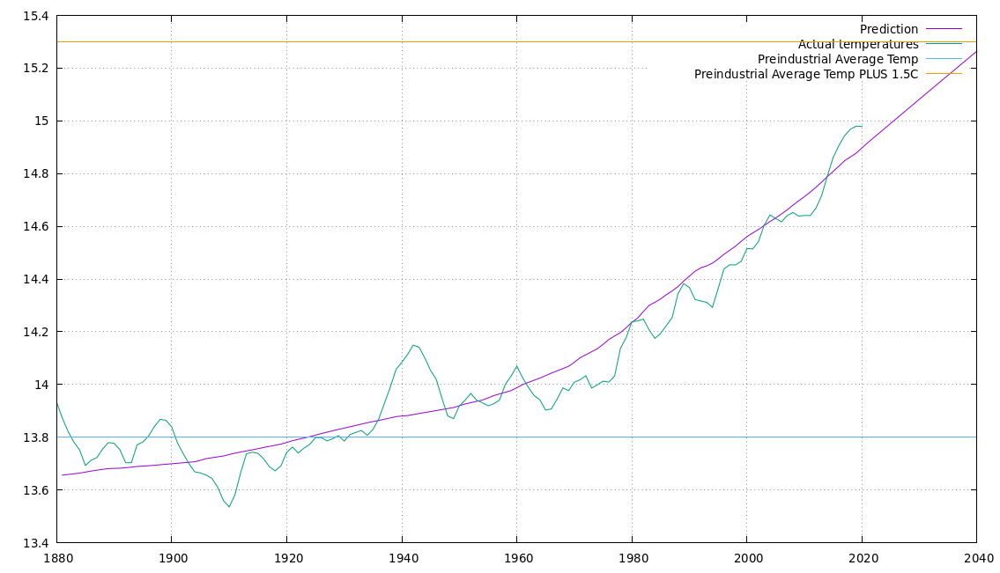

# Global-Warming-Simple-Model
This is a simple model of global warming that I put together and fitted to data a couple
of years back. It is based on a one layer atmosphere model - see https://www.acs.org/content/acs/en/climatescience/atmosphericwarming/singlelayermodel.html

(The above link also presents a more complex, three layer atmosphere model - this may be interesting to look at and update another time)

The simple model had some free parameters that needed to be optimized to fit the temperature
hsitory data. My motivation was to understand how well the theory that greenhouse
gas increased concentrations was driving the reported temperature increases works.

The free parameters are:

  1. Factor quantifying impact of CO2 in calculating the emissivity of the atmosphere
  2. Factor quantifying impact of CH4 in calculating the emissivity of the atmosphere
  3. Factor quantifying impact of N20 in calculating the emissivity of the atmosphere
  4. "Velocity" parameter that measures how quickly the earth system moves towards a new equilibrium temperature when this changes
  5. Residual factor in emissivity calculation
  
Most of the above are related to the emissivity calculation as a function of GHG concentrations. When I used the parameters
that best fitted the observed temperature history, the model calculated an emissivity of 0.78 for the earth's atmosphere, which 
the www.acs.org page mentioned at the start indicates is about the right value.

One problem in fitting the temperature history is that the CO2, CH4 and N2O concentrations are strongly correlated
so it is a little difficult to correctly separate out the effects of each - e.g., as a large part of the variation is
correlated, the opmtimizer could end up assigning too much weight to N2O and too little weight to CO2.

*I will try to improve this short description page in the future - I'm afraid some of the above explanations
are not as clear as they might be.*

By the way, the optimizer I used to choose the free parameter values was the the particle-swarm-optimizer written in Lua
which is available in another one of my repos. The "adaptor" program for the globalwarming python script is available in that
 repo too.
 
 The figure below was generated using Gnuplot, the smoothed observed temperature history and a run of the Python warming model 
 using optimized parameters to generate the predicted line. A couple of observations. Firstly, the overall trend is reproduced well, but, secondly, 
 there are a number of bumps and troughs that are not well reproduced and I don't think can reasonably be attributed to changes
 in CO2 & other GHG concentrations. In particular, there is a strong peak in the 1940s which doesn't match changes in the GHG concentrations.
 
 The recent history is reproduced well and I've extended the modeled temperatures out to 2040 - it will be interesting to see
 how good the predictions are over the next few years. (In fact, when I originally created this model I only had temperatures out
 to around 2010 - even though the model is more recent than that - and it's done quite well over the period 2010-2020)
 
 
